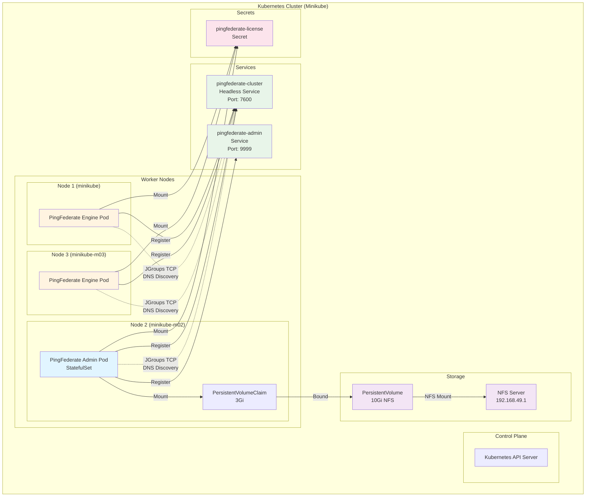
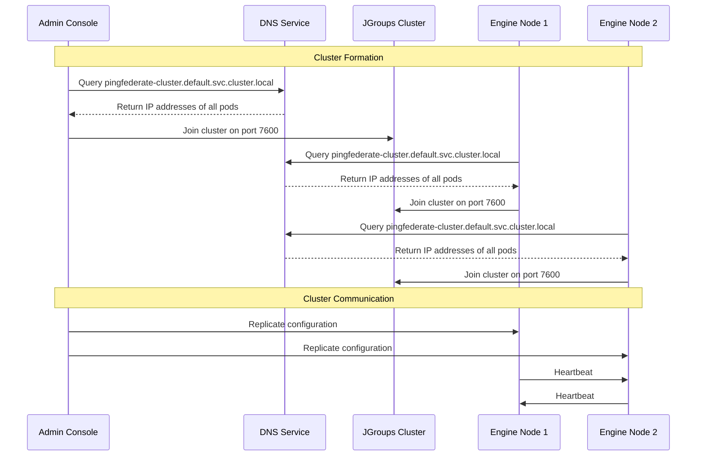
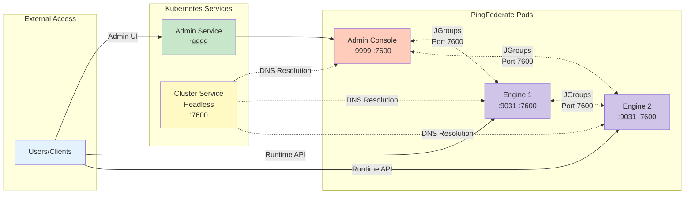

# PingFederate Kubernetes Deployment

A production-ready PingFederate deployment on Kubernetes using DNS-based clustering with Minikube.

## 📋 Table of Contents

- [Overview](#overview)
- [Architecture](#architecture)
- [Prerequisites](#prerequisites)
- [Installation](#installation)
- [Configuration](#configuration)
- [Deployment](#deployment)
- [Verification](#verification)
- [Troubleshooting](#troubleshooting)
- [Cleanup](#cleanup)

## 🎯 Overview

This repository contains Kubernetes manifests for deploying PingFederate in a clustered configuration using:
- **Admin Console**: 1 replica (StatefulSet)
- **Engine Nodes**: 1+ replicas (StatefulSet)
- **DNS-based Discovery**: JGroups DNS_PING for cluster formation
- **NFS Storage**: Persistent volume for admin console data

## 🏗️ Architecture



### Component Communication Flow



## ✅ Prerequisites

### Required Software

- **Minikube**: v1.30.0 or later
- **kubectl**: v1.27.0 or later
- **Docker**: v20.10.0 or later (or other container runtime)
- **NFS Server**: For persistent storage

### System Requirements

- **CPU**: 4 cores minimum (2 cores per node)
- **Memory**: 8GB minimum (4GB for Minikube)
- **Disk**: 20GB free space

## 🚀 Installation

### Step 1: Start Minikube with Multiple Nodes

```bash
# Start Minikube with 3 nodes
minikube start --nodes 3 --cpus 2 --memory 4096 --driver=docker

# Verify nodes are running
kubectl get nodes
```

Expected output:
```
NAME           STATUS   ROLES           AGE   VERSION
minikube       Ready    control-plane   5m    v1.27.0
minikube-m02   Ready    <none>          4m    v1.27.0
minikube-m03   Ready    <none>          3m    v1.27.0
```

### Step 2: Set Up NFS Server

```bash
# On your host machine (192.168.49.1)
sudo mkdir -p /home/ping/Kubernetes/pingfederate-admin-out
sudo chown -R nobody:nogroup /home/ping/Kubernetes/pingfederate-admin-out
sudo chmod 777 /home/ping/Kubernetes/pingfederate-admin-out

# Configure NFS exports
echo "/home/ping/Kubernetes/pingfederate-admin-out *(rw,sync,no_subtree_check,no_root_squash)" | sudo tee -a /etc/exports

# Restart NFS server
sudo exportfs -ra
sudo systemctl restart nfs-kernel-server
```

### Step 3: Create PingFederate License Secret

```bash
# Create secret from your license file
kubectl create secret generic pingfederate-license \
  --from-file=pingfederate.lic=/path/to/your/pingfederate.lic

# Verify secret creation
kubectl get secret pingfederate-license
```

## ⚙️ Configuration

### Key Environment Variables

| Variable | Admin Value | Engine Value | Description |
|----------|-------------|--------------|-------------|
| `OPERATIONAL_MODE` | `CLUSTERED_CONSOLE` | `CLUSTERED_ENGINE` | Node role in cluster |
| `PF_CLUSTER_BIND_ADDRESS` | `NON_LOOPBACK` | `NON_LOOPBACK` | Bind to all interfaces |
| `DNS_QUERY_LOCATION` | `pingfederate-cluster.default.svc.cluster.local` | `pingfederate-cluster.default.svc.cluster.local` | DNS query for discovery |
| `PF_CLUSTER_TRANSPORT_PROTOCOL` | `tcp` | `tcp` | JGroups protocol |
| `PF_CLUSTER_BIND_PORT` | `7600` | `7600` | JGroups port |
| `DISCOVERY_TAG` | DNS_PING configuration | DNS_PING configuration | JGroups discovery method |

### Networking Diagram



## 📦 Deployment

### Deploy All Resources

```bash
# Apply the configuration
kubectl apply -f PingFederate-Kubernetes.yaml

# Wait for pods to be ready
kubectl wait --for=condition=ready pod -l app=pingfederate --timeout=300s
```

### Deploy Step-by-Step

```bash
# 1. Create Secret (if not already created)
kubectl apply -f PingFederate-Kubernetes.yaml --dry-run=client -o yaml | grep -A 10 "kind: Secret" | kubectl apply -f -

# 2. Create Persistent Volume
kubectl apply -f PingFederate-Kubernetes.yaml --dry-run=client -o yaml | grep -A 15 "kind: PersistentVolume" | kubectl apply -f -

# 3. Create Persistent Volume Claim
kubectl apply -f PingFederate-Kubernetes.yaml --dry-run=client -o yaml | grep -A 10 "kind: PersistentVolumeClaim" | kubectl apply -f -

# 4. Create Services
kubectl apply -f PingFederate-Kubernetes.yaml --dry-run=client -o yaml | grep -A 12 "kind: Service" | kubectl apply -f -

# 5. Deploy Admin Console
kubectl apply -f PingFederate-Kubernetes.yaml --dry-run=client -o yaml | grep -A 100 "name: pingfederate-admin" | kubectl apply -f -

# 6. Deploy Engine Nodes
kubectl apply -f PingFederate-Kubernetes.yaml --dry-run=client -o yaml | grep -A 100 "name: pingfederate-engine" | kubectl apply -f -
```

## ✔️ Verification

### Check Pod Status

```bash
# View all PingFederate pods
kubectl get pods -l app=pingfederate

# Expected output:
# NAME                      READY   STATUS    RESTARTS   AGE
# pingfederate-admin-0      1/1     Running   0          5m
# pingfederate-engine-0     1/1     Running   0          5m
```

### Check Services

```bash
# List services
kubectl get svc

# Expected output:
# NAME                      TYPE        CLUSTER-IP      EXTERNAL-IP   PORT(S)    AGE
# pingfederate-admin        ClusterIP   10.96.xxx.xxx   <none>        9999/TCP   5m
# pingfederate-cluster      ClusterIP   None            <none>        7600/TCP   5m
```

### Check Cluster Formation

```bash
# Check admin console logs
kubectl logs pingfederate-admin-0 | grep -i "cluster"

# Check engine logs
kubectl logs pingfederate-engine-0 | grep -i "cluster"

# Look for messages like:
# "Received new cluster view"
# "Successfully joined cluster"
```

### Access Admin Console

```bash
# Port forward to access admin console
kubectl port-forward svc/pingfederate-admin 9999:9999

# Open browser to:
# https://localhost:9999/pingfederate/app

# Default credentials (if not configured):
# Username: administrator
# Password: 2FederateM0re
```

### Verify Cluster Status

1. Log into the Admin Console
2. Navigate to: **System** → **Cluster Management**
3. Verify all nodes appear in the cluster

## 🐛 Troubleshooting

### Pods Not Starting

```bash
# Check pod events
kubectl describe pod pingfederate-admin-0

# Check logs
kubectl logs pingfederate-admin-0

# Common issues:
# - License file not mounted correctly
# - NFS volume not accessible
# - Insufficient resources
```

### Cluster Formation Issues

```bash
# Test DNS resolution
kubectl run -it --rm debug --image=busybox --restart=Never -- nslookup pingfederate-cluster.default.svc.cluster.local

# Check JGroups port
kubectl exec pingfederate-admin-0 -- netstat -tuln | grep 7600

# Verify environment variables
kubectl exec pingfederate-admin-0 -- env | grep -E 'CLUSTER|DNS|DISCOVERY'
```

### NFS Mount Issues

```bash
# Check PV status
kubectl get pv

# Check PVC binding
kubectl get pvc

# Test NFS mount from pod
kubectl exec pingfederate-admin-0 -- df -h | grep /opt/out
```

### Performance Issues

```bash
# Check resource usage
kubectl top nodes
kubectl top pods -l app=pingfederate

# Increase resources if needed
kubectl edit statefulset pingfederate-admin
kubectl edit statefulset pingfederate-engine
```

## 🔄 Scaling

### Scale Engine Nodes

```bash
# Scale to 3 engine replicas
kubectl scale statefulset pingfederate-engine --replicas=3

# Verify scaling
kubectl get pods -l role=engine

# Check cluster status in admin console
```

## 🧹 Cleanup

### Remove Deployment

```bash
# Delete all resources
kubectl delete -f PingFederate-Kubernetes.yaml

# Or delete individually
kubectl delete statefulset pingfederate-admin pingfederate-engine
kubectl delete svc pingfederate-admin pingfederate-cluster
kubectl delete pvc pingfederate-admin-pvc
kubectl delete pv pingfederate-admin-pv
kubectl delete secret pingfederate-license
```

### Stop Minikube

```bash
# Stop Minikube cluster
minikube stop

# Delete Minikube cluster
minikube delete
```

## 📚 Additional Resources

- [PingFederate Documentation](https://docs.pingidentity.com/bundle/pingfederate-110/page/pingfederate-landing.html)
- [Kubernetes Documentation](https://kubernetes.io/docs/home/)
- [Minikube Documentation](https://minikube.sigs.k8s.io/docs/)
- [JGroups Documentation](http://jgroups.org/manual4/index.html)

## 📝 License

This configuration uses PingFederate which requires a valid license from Ping Identity.

## 🤝 Contributing

Contributions are welcome! Please feel free to submit a Pull Request.

---

**Note**: This is a development/testing configuration. For production deployments, consider:
- Using managed Kubernetes (EKS, GKE, AKS)
- Implementing proper monitoring and alerting
- Setting up ingress controllers
- Configuring TLS/SSL certificates
- Implementing backup and disaster recovery
- Using proper secrets management (Vault, etc.)